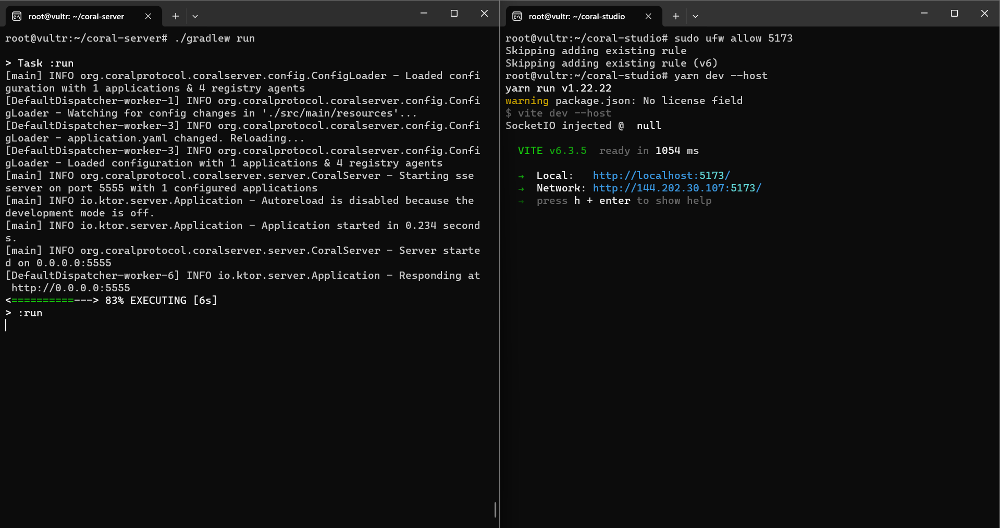
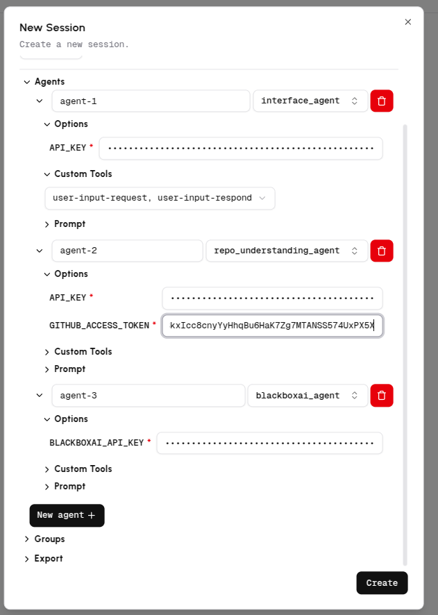

# BlackBoxAI: Blackbox-AI-Coding-Agent-w-Coral

This guide helps you build an next-generation AI-driven coder with BLACKBOX.AI and Coral Protocl. Follow step-by-step setup instructions for agents, server, and UI.

### Introduction

- The BLACKBOX.AI Track invites you to harness the power of the BLACKBOX.AI Coding Agent as the centerpiece of your workflow. Push the boundaries of AI-driven software development by building innovative tools that supercharge productivity, accelerate prototyping, or transform the coding experience itself. BLACKBOX.AI provides advanced, real-time coding intelligence, allowing you to automate complex developer workflows, refactor code, generate documentation, or review pull requests with natural language.

- The example of Coral Protocol solution is an Intelligent Coder system that enables advanced, context-aware code generation and understanding through multi-agent collaboration. The Intelligent Coder combines an interface agent, a repository understanding agent, and a BLACKBOX.AI agent integrated within Coral. Users interact with the interface agent via natural language to request code generation or ask about specific repositories. The repository understanding agent retrieves and analyzes relevant code from selected repos, providing essential context. Leveraging both this contextual information and the powerful capabilities of the BLACKBOX.AI agent, the system can generate new code tailored to the user's requirements—grounded in real-world codebases. This approach allows for seamless, intelligent code synthesis and reuse, all orchestrated through the Coral Protocol’s structured messaging and coordination framework.
- Agents: [Interface Agent](https://github.com/Coral-Protocol/Coral-Interface-Agent) | [BLACKBOX.AI Agent(https://github.com/Coral-Protocol/Coral-BlackboxAI-Agent)) | [Repo Understanding Agent](https://github.com/Coral-Protocol/Coral-RepoUnderstanding-Agent) 
- [Demo Video](https://drive.google.com/file/d/1yE9p_h9-WMPu_lb21q-GR84gkiZbhqXu/view?usp=sharing)

  

### Outline

- **Setup Coral Server and Coral Studio**  
  Step-by-step guide to install and run Coral Server and Coral Studio with necessary dependencies (Java, Yarn, Node.js).

- **Setup the Agents**  
  Instructions to install and configure the Interface Agent, BLACKBOX.AI Agent and Repo Understanding Agent using uv.

- **Run the Agents**  
  Available options to run agents:
  - Executable Mode with Coral Studio Orchestrator  
  - Dev Mode (terminal-based) for easier debugging  

- **Example**  
  Sample input and output to get results.


### How to run step by step

### 1. Setup Coral Server and Coral Studio

<details>

- To setup the [Coral Server](https://github.com/Coral-Protocol/coral-server) and [Coral Studio UI](https://github.com/Coral-Protocol/coral-studio), follow the steps given in repository to install.

- In order to test if both are working, open the same instance in two terminals and run both simultaneously.

```bash
# run studio
yarn dev
```
- You will see both running like this simultaneously if succesful and should be able to access Coral Studio from your browser.



- On Coral Studio, ensure the connection to Coral Server.


<details>

<summary>Install Java if UNAVAILABLE in order to run Coral Server</summary>

Install Java

```bash

# Apt update
sudo apt update

# Install the JDK
sudo apt install openjdk-17-jdk

# Check version
java -version
```

Run Coral Server

```bash

./gradlew run

```

</details>

<details>

<summary>Install Yarn if UNAVAILABLE in order to run Coral Studio</summary>

Install Yarn

```bash
# Download and install nvm:
curl -o- https://raw.githubusercontent.com/nvm-sh/nvm/v0.40.3/install.sh | bash

# in lieu of restarting the shell
\. "$HOME/.nvm/nvm.sh"

# Download and install Node.js:
nvm install 22

# Verify the Node.js version:
node -v # Should print "v22.17.0".
nvm current # Should print "v22.17.0".

# Download and install Yarn:
corepack enable yarn

# Verify Yarn version:
yarn -v

# Install from yarn
yarn install

# Allow port for eternal access
sudo ufw allow 5173

```

Run Coral Studio

```bash

yarn dev

```

</details>

</details>

### 2. Setup the Agents

<details>  

- Terminate the Coral Server and Coral Studio connections from above and start below steps.
- In this example, we are using the agents: [Interface Agent](https://github.com/Coral-Protocol/Coral-Interface-Agent),[BLACKBOX.AI Agent]([Coral-BlackboxAI-Agent](https://github.com/Coral-Protocol/Coral-BlackboxAI-Agent)), and [Repo Understanding Agent](https://github.com/Coral-Protocol/Coral-RepoUnderstanding-Agent) .  
- Please click on the link and set up the agents by following the setup instructions in the repository.  
- Check the output below to see how the terminal will look after succesfull installation, keep in mind the directory you are at while doing `uv sync`.


</details>

### 3. Run the Agents

<details>

<summary>You can run in either of the below modes to get your system running.</summary>

#### 1. Executable Mode

<details>

- The Executable Mode is part of the Coral Protocol Orchestrator which works with [Coral Studio UI](https://github.com/Coral-Protocol/coral-studio).  

- Checkout: [How to Build a Multi-Agent System with Awesome Open Source Agents using Coral Protocol](https://github.com/Coral-Protocol/existing-agent-sessions-tutorial-private-temp).  

- Update the file: `coral-server/src/main/resources/application.yaml` with the details below. 

```bash
# replace "root" with YOUR/PROJECT/DIRECTORY if different

applications:
  - id: "app"
    name: "Default Application"
    description: "Default application for testing"
    privacyKeys:
      - "default-key"
      - "public"
      - "priv"

registry:
  interface:
    options:
      - name: "API_KEY"
        type: "string"
        description: "API key for the service"
    runtime:
      type: "executable"
      command: ["bash", "-c", "/root/Coral-Interface-Agent/run_agent.sh main.py"]
      environment:
        - name: "API_KEY"
          from: "API_KEY"
        - name: "MODEL_NAME"
          value: "gpt-4.1"
        - name: "MODEL_PROVIDER"
          value: "openai"
        - name: "MODEL_TOKEN"
          value: "16000"
        - name: "MODEL_TEMPERATURE"
          value: "0.3"
          
  repo_understanding_agent:
    options:
      - name: "API_KEY"
        type: "string"
        description: "API key for the service"
      - name: "GITHUB_ACCESS_TOKEN"
        type: "string"
        description: "key for the github service"
    runtime:
      type: "executable"
      command: ["bash", "-c", "/root/Coral-RepoUnderstanding-Agent/run_agent.sh main.py"]
      environment:
        - name: "API_KEY"
          from: "API_KEY"
        - name: "GITHUB_ACCESS_TOKEN"
          from: "GITHUB_ACCESS_TOKEN"
        - name: "MODEL_NAME"
          value: "gpt-4.1"
        - name: "MODEL_PROVIDER"
          value: "openai"
        - name: "MODEL_TOKEN"
          value: "16000"
        - name: "MODEL_TEMPERATURE"
          value: "0.3"

  blackboxai_agent:
    options:
      - name: "BLACKBOXAI_API_KEY"
        type: "string"
        description: "API key for the service"
    runtime:
      type: "executable"
      command: ["bash", "-c", "/root/Coral-BlackboxAI-Agent/run_agent.sh main.py"]
      environment:
        - name: "BLACKBOXAI_API_KEY"
          from: "BLACKBOXAI_API_KEY"
        - name: "BLACKBOXAI_URL"
          value: "https://api.blackbox.ai"
        - name: "MODEL_NAME"
          value: "blackboxai/openai/gpt-4.1"
```

- Run the [Coral Server](https://github.com/Coral-Protocol/coral-server) and [Coral Studio](https://github.com/Coral-Protocol/coral-studio). 

- You do not need to set up the `.env` in the project directory for running in this mode; it will be captured through the variables below.  

- After the agents are loaded properly, you will see "3 agents" connected. Proceed ahead with "Select Session", add the agents, api key and esure to add both the Custom Tools to the Interface Agent.

  

</details>

#### 2. Dev Mode

<details>

- The Dev Mode allows the Coral Server and all agents to be seaprately running on each terminal without UI support.  

- Ensure that the [Coral Server](https://github.com/Coral-Protocol/coral-server) is running on your system and run below commands in separate terminals.

- Ensure that you have setup the `.env` file with required keys.  

Run the Interface Agent

```bash
# cd to directory
cd Coral-Interface-Agent

# Run the agent using `uv`:
uv run python main.py
```

Run the RepoUnderstanding Agent

```bash
# cd to directory
cd Coral-RepoUnderstanding-Agent

# Run the agent using `uv`:
uv run python main.py
```

Run the BLACKBOX.AI Agent

```bash
# cd to directory
cd Coral-BlackboxAI-Agent-Agent

# Run the agent using `uv`:
uv run python main.py
```

</details>

</details>


### 5. Example

<details>

```bash
# Input:
Question: Could you please call repo understanding agent to retrieve the completed code of agent implementation on the main branch of Coral-Protocol/Coral-Monzo-Agent, keep it, and send the completed code to balckbox ai agent, ask it to take this as an example, then create an agent that is able to run on coral server with functionality of a simple calculator (add number)

# Output:
Answer: Thank you for sharing the code. Here is an example of a simple addition agent for Coral Server, following the structure, event loop, and integration style from your provided `main.py`. This agent exposes a single tool `add_numbers(a: int, b: int) -&gt; int`, and uses the same Coral tool patterns:

import asyncio
import os
import json
import logging
from langchain_mcp_adapters.client import MultiServerMCPClient
from langchain.prompts import ChatPromptTemplate
from langchain.agents import create_tool_calling_agent, AgentExecutor
from langchain.chat_models import init_chat_model
from langchain_core.tools import tool
from dotenv import load_dotenv
import urllib.parse
from datetime import datetime
import traceback

# Setup logging
logging.basicConfig(level=logging.INFO, format=&quot;%(asctime)s - %(levelname)s - %(message)s&quot;)
logger = logging.getLogger(__name__)

# Load environment variables
load_dotenv()

base_url = os.getenv(&quot;CORAL_SSE_URL&quot;)
agentID = os.getenv(&quot;CORAL_AGENT_ID&quot;)

params = {
    &quot;agentId&quot;: agentID,
    &quot;agentDescription&quot;: &quot;An agent that simply adds two numbers using the add_numbers(a, b) tool. Only use the provided tools!&quot;
}
query_string = urllib.parse.urlencode(params)
MCP_SERVER_URL = f&quot;{base_url}?{query_string}&quot;

def get_tools_description(tools):
    return &quot;\n&quot;.join(f&quot;Tool: {t.name}, Schema: {json.dumps(t.args).replace('{', '{{').replace('}', '}}')}&quot; for t in tools)

@tool
def add_numbers(a: int, b: int) -&gt; dict:
    &quot;&quot;&quot;
    Adds two integers and returns the result.

    Args:
        a (int): The first number.
        b (int): The second number.
    Returns:
        dict: The sum as `result`.
    &quot;&quot;&quot;
    return {&quot;result&quot;: a + b}

async def create_addition_agent(client, tools):
    prompt = ChatPromptTemplate.from_messages([
        (&quot;system&quot;, f&quot;&quot;&quot;You are `addition_agent`, responsible only for adding two numbers with add_numbers(a, b). You must only use the provided tools to fulfill user requests. Your workflow:\n\n1. Use wait_for_mentions(timeoutMs=60000) to wait for instructions.\n2. When a mention is received, record threadId and senderId (NEVER forget these two).\n3. Read the user's message and extract the numbers to add.\n4. Call add_numbers(a, b) with them.\n5. Generate a clear, direct reply with the result.\n6. If error, reply 'error'.\n7. Use send_message(senderId=..., mentions=[senderId], threadId=..., content=&quot;your answer&quot;) to reply.\n8. Always respond to the user.\n9. Wait 2 seconds and go back to step 1.\n\nTools: {get_tools_description(tools)}&quot;),
        (&quot;placeholder&quot;, &quot;{history}&quot;),
        (&quot;placeholder&quot;, &quot;{agent_scratchpad}&quot;)
    ])

    model = init_chat_model(
        model=os.getenv(&quot;MODEL&quot;),
        model_provider=os.getenv(&quot;LLM_MODEL_PROVIDER&quot;),
        api_key=os.getenv(&quot;API_KEY&quot;),
        temperature=0.3,
        max_tokens=32768
    )
    agent = create_tool_calling_agent(model, tools, prompt)
    return AgentExecutor(agent=agent, tools=tools, verbose=True)

async def main():
    CORAL_SERVER_URL = f&quot;{base_url}?{query_string}&quot;
    logger.info(f&quot;Connecting to Coral Server: {CORAL_SERVER_URL}&quot;)

    client = MultiServerMCPClient(
        connections={
            &quot;coral&quot;: {
                &quot;transport&quot;: &quot;sse&quot;,
                &quot;url&quot;: CORAL_SERVER_URL,
                &quot;timeout&quot;: 600,
                &quot;sse_read_timeout&quot;: 600,
            }
        }
    )
    logger.info(&quot;Coral Server Connection Established&quot;)

    tools = await client.get_tools()
    coral_tool_names = [
        &quot;list_agents&quot;,
        &quot;create_thread&quot;,
        &quot;add_participant&quot;,
        &quot;remove_participant&quot;,
        &quot;close_thread&quot;,
        &quot;send_message&quot;,
        &quot;wait_for_mentions&quot;,
    ]
    tools = [tool for tool in tools if tool.name in coral_tool_names]
    tools += [add_numbers]

    logger.info(f&quot;Tools Description:\n{get_tools_description(tools)}&quot;)

    agent_executor = await create_addition_agent(client, tools)

    while True:
        try:
            logger.info(&quot;Starting new agent invocation&quot;)
            await agent_executor.ainvoke({&quot;agent_scratchpad&quot;: []})
            logger.info(&quot;Completed agent invocation, restarting loop&quot;)
            await asyncio.sleep(1)
        except Exception as e:
            logger.error(f&quot;Error in agent loop: {str(e)}&quot;)
            logger.error(traceback.format_exc())
            await asyncio.sleep(5)

if __name__ == &quot;__main__&quot;:
    asyncio.run(main())

Let me know if you'd like this as a file, or need further customization!
```

</details>

</details>


### Where to find support 

If you have any questions about anything you can join our discord here, and put something in the dev support channel, if you beleivie it to be a bug or a feate that you want you can add it as a github issue [Discord](https://discord.com/invite/Xjm892dtt3)


